## Home page

This is the main page that people will see when they
get to the Web site.

## Create User page

Main form that will be used to enter user information to create a user.

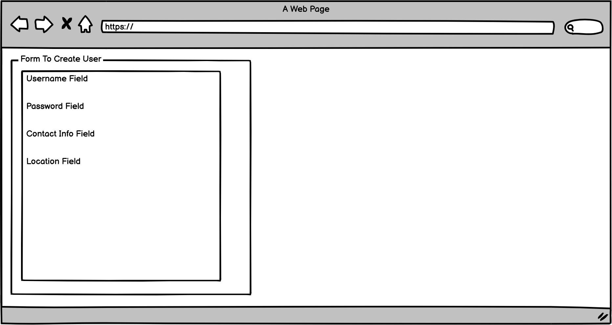

## User Settings page

Main form that will be used to update user information.

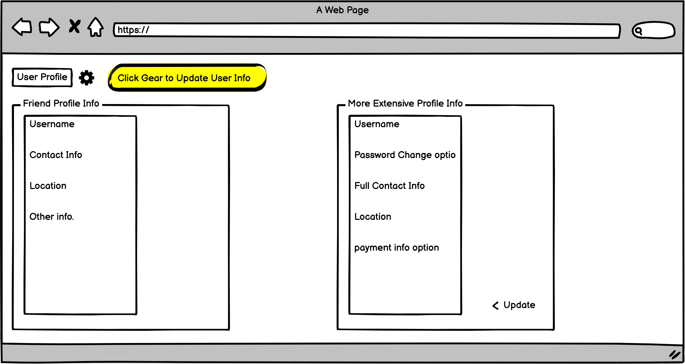

## Concert List page

Users will entire date availability and be presented with lists of concerts based on their availability and user location.

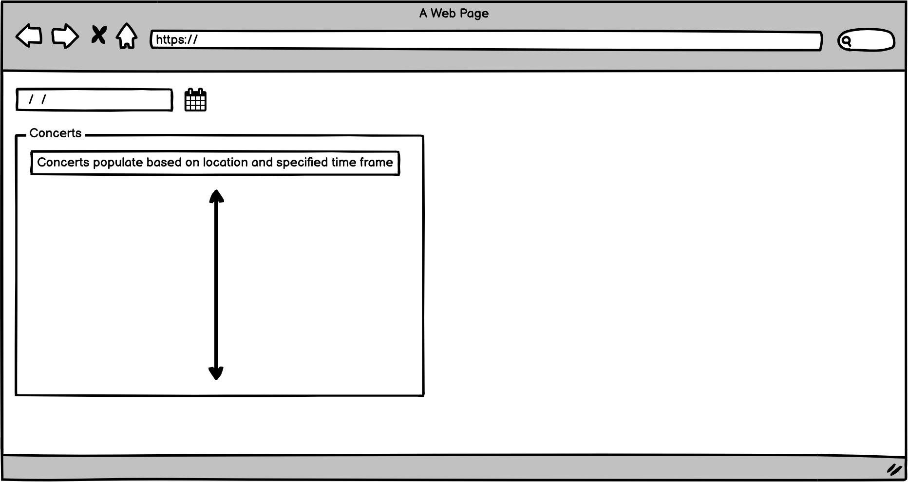

## User Attending List page

Users will be able to see a list of all the concerts they are attending. When they select a concert, they will be able to see a list of other attendees for that concert.

## Friends Profile page

Users can select a user from their friends list and its shows their concert list information.

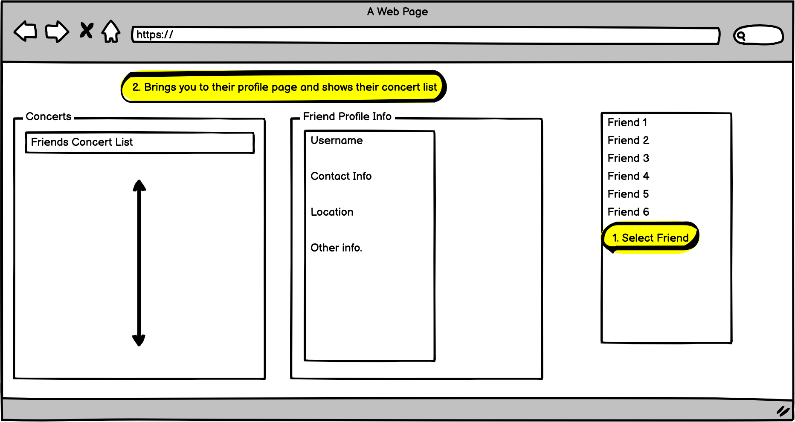

## Checkout

Checkout page for ticket sales.

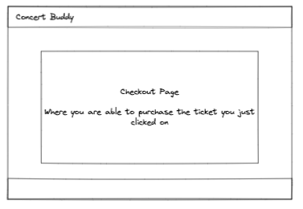

## Completed-Sales

Completed sales for each seller account.

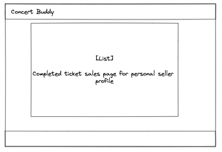

## Concert-Details

Detail page for concert that user has selected to buy tickets for.

## Event-List

List of events for user to select from for buying or selling.

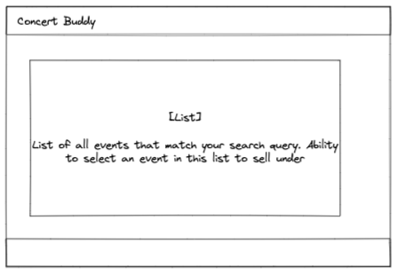

## Location-Details

List of events for each venue.

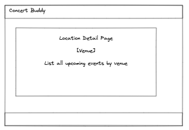

## Manage-Friendships

User can add and remove friends.

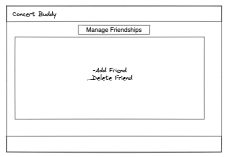

## Marketplace

User can search for concert or venue to buy/sell tickets for.

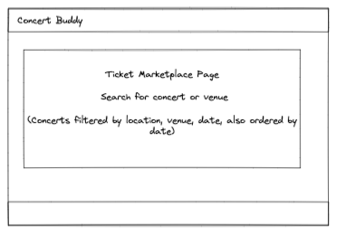

##  Registration

User can login, logout, or register for service.

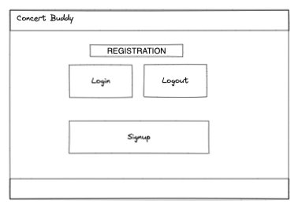

## Seller-Ticket-Listing

Seller can manage tickets for sale.

## Ticket-Sale-Form

Form for seller to add a ticket for sale.

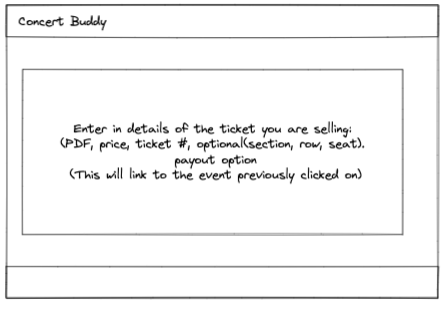

## Ticket-Sales 

List for seller to find the event to sell tickets under.

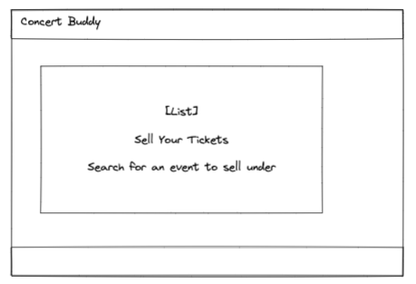
