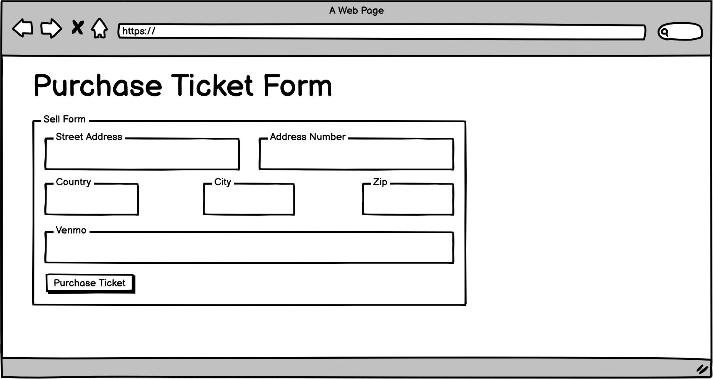

## Home page

This is the main page that people will see when they
get to the Web site.

## Find a Buddy / Sell Tickets page

Find a buddy and sell tickets both utilize a search feature that searches for concerts based on city name or artist name.
There is a toggle feature to switch between the two search options. Once a search is submitted, a table will populate containing
all of the concerts taking place within the next few days that match the search criteria. Buttons to attend the concert and sell
tickets are available for each concert.

## Purchased Tickets Page

The purchased tickets page will contain information regarding tickets that have been bought by the user's account. This will include
concert date, artist, ticket price, and ticket seat information. Tickets will be displayed in two separate tables based on whether
the concert has already taken place or the concert will occur in the future. The purchased tickets page will have a button redirecting
users back to the find a buddy / sell tickets page.

## Concerts I am Attending page

When users click on the attending button for concerts listed in their search results, those specific concerts will be compiled in a list
that is viewable by the user. This Concerts I am Attending page will list out all the concerts with their concert details along with buttons to see other users going, sell tickets, buy tickets, and remove concerts from the list.

## My Tickets for Sale page

Users will be able to see a personalized list containing all of their tickets that they are selling or have sold. A toggle button will allow
users to switch between which tickets are viewable on the page, tickets sold or tickets listed. A button will allow users to post new ticket
listings directly from the page.

## User Attending List page

From the Concerts I am Attending page, users will be able to click a button to see other Concert Buddy Users that are attending the same concert.
This page will list the attending users by their emails so that users can coordinate and attend concerts together.

## Concert Details

When a user selects a concert to add to their list from their concert search, users will be automatically redirected to a concert details page.
This page will include information for the specific concert and list any tickets for sale for the specific concert. From their users will be able
to either purchase a ticket or sell a ticket for the concert.

## Sell Ticket Form

Users will list tickets by submitting ticket details into a form. This form will include fields for seat information, price, and a url for a picture of the ticket.

## Purchase Ticket Form

Users will purchase tickets by submitting user information into a form. This form will include fields for user shipping information and venmo payment information.

## Sign-in

User sign in form

## Sign-up

User sign up form

